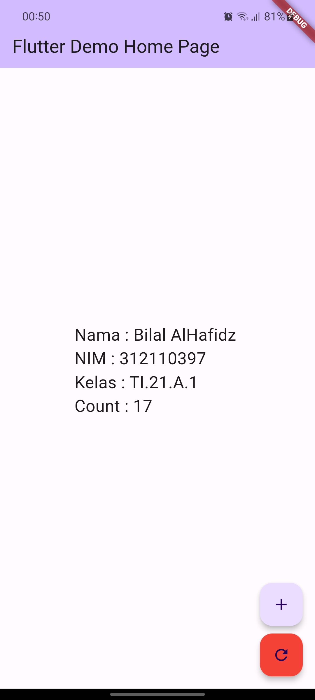

# Tugas Pemograman Mobile 2
## Profil

| #               | Biodata              |
| --------------- | -------------------- |
| **Nama**        | Bilal AlHafidz       |
| **NIM**         | 312110397            |
| **Kelas**       | TI.21.A.1            |
| **Mata Kuliah** | Pemrograman Mobile 2 |

# Penjelasan
<p>Untuk membuat sebuah aplikasi Flutter dengan tampilan UI sederhana yang terdiri dari satu halaman (page) yang menampilkan teks dan tombol. Berikut ini penjelasan dari kode tersebut.</p>

1. Import Package
```dart
import 'package:flutter/material.dart';
```
<p>Kode tersebut berfungsi untuk mengimport package material.dart dari Flutter Framework yang dibutuhkan untuk membuat tampilan UI.</p>

2. Function Main
```dart
void main() {
  runApp(const MyApp());
}
```
<p>Kode tersebut adalah function main() yang dijalankan pada saat aplikasi di-run. Pada kode di atas, runApp() dipanggil dengan argument MyApp(), yaitu sebuah class MyApp yang akan dijalankan.</p>

3. Class MyApp
```dart
class MyApp extends StatelessWidget {
  const MyApp({super.key});

  @override
  Widget build(BuildContext context) {
    return MaterialApp(
      title: 'Flutter Demo',
      theme: ThemeData(
        colorScheme: ColorScheme.fromSeed(seedColor: Colors.deepPurple),
        useMaterial3: true,
      ),
      home: const MyHomePage(title: 'Flutter Demo Home Page'),
    );
  }
}
```
<p>Kode di atas adalah class MyApp yang merupakan turunan dari class StatelessWidget. MyApp merupakan class utama yang akan dijalankan ketika aplikasi di-run.<br>Method build() di dalam class MyApp akan mengembalikan tampilan UI utama aplikasi, yaitu MaterialApp. MaterialApp merupakan sebuah widget yang menyediakan beberapa konfigurasi, seperti judul (title), tema (theme), dan tampilan halaman utama (home).</p>

4. Class MyHomePage
```dart
class MyHomePage extends StatefulWidget {
  const MyHomePage({super.key, required this.title});

  final String title;

  @override
  State<MyHomePage> createState() => _MyHomePageState();
}

class _MyHomePageState extends State<MyHomePage> {
  int _counter = 0;

  void _incrementCounter() {
    setState(() {
      _counter++;
    });
  }

  void _resetCounter() {
    setState(() {
      _counter = 0;
    });
  }

  @override
  Widget build(BuildContext context) {
    // ...
  }
}
```
<p>Kode di atas adalah class MyHomePage, yang merupakan turunan dari class StatefulWidget. MyHomePage memiliki state (stateful) dan dua method yaitu _incrementCounter() dan _resetCounter() untuk melakukan perubahan pada _counter.<br>
Method build() di dalam class _MyHomePageState akan mengembalikan tampilan UI untuk halaman utama aplikasi, yaitu Scaffold yang memiliki beberapa widget turunan seperti AppBar, Center, dan FloatingActionButton.<br>
Dalam Scaffold, pada bagian appBar akan ditampilkan sebuah AppBar dengan judul (title) yang diambil dari MyHomePage.title. Sedangkan pada bagian body, akan ditampilkan sebuah Center yang berisi sebuah Column yang berisikan teks Nama : Bilal AlHafidz | NIM : 312110397 | Kelas : TI.21.A.1 | Count : $_counter.<br>
Pada bagian floatingActionButton, terdapat dua FloatingActionButton, yang masing-masing memiliki method yang berbeda (_incrementCounter() dan _resetCounter()) dan tampilan yang berbeda pula.</p>

## Output


# Terima Kasih!